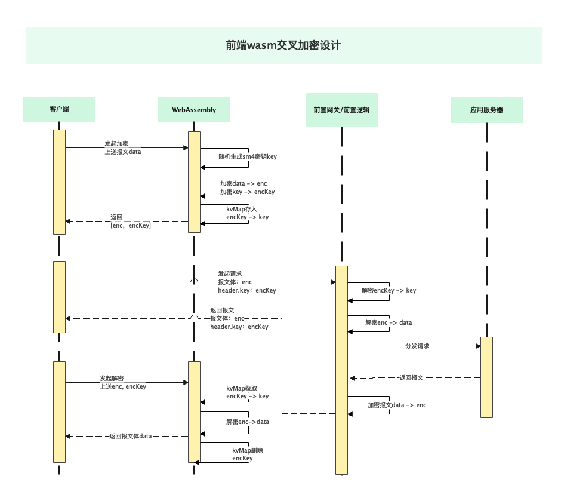

# web-cross-encrypt

## 项目介绍
作为一个前端开发，总想把自己代码弄得更加神秘，更加难以被调试破解。
其中接口报文是最容易被人调试破解的一部分。
通过全报文加密可以实现接口报文的不可视化。
但是使用对称加密会将密钥暴露给调试者、非对称加密则会对服务器造成巨大负担。

故，有了这个方案，随机生成国密sm4密钥，通过sm4加密全报文，然后用sm2对随机生成sm4密钥进行加密。
因使用16位长度的sm4密钥，
***（具体应用时可协商降低16位长度，比如随机8位+协商8位）***
大大降低了sm2解密耗时。

## wasm
通过引入WebAssembly降低代码可调试性，这里选用golang来编译wasm文件。
加密源码来源于[同济区块链gmsm项目](https://github.com/tjfoc/gmsm) 。

## 特性
* 国密sm4使用PKCS7Padding补位
* 暴露doEncrypt、doDecrypt给web端使用，并挂载在window下，命名为：encrypt、decrypt
* 服务端返回报文必须携带上送的sm4密钥密文
* 前端通过内存kvMap对sm4密钥密文与sm4密钥明文转换进行管理

## 使用方式
```js
var enc = encrypt('web-cross-encrypt')
> (2) ["3IavdMPTbJCVEMxK8QXxDU5wP0l7L5a9WL/DQTPgiaw=", "MHkCIHucWfF1FkiDNrRJyTNTJ1tCLJZOCNki4B3OXXvnmNcuAi…QQAJmq3juq6/v1D4up+cRsaydBBD7Zt/LsZV5XYD0eHt1Nqwx"]
decrypt(...enc)
> 'web-cross-encrypt'
decrypt(...enc) // 每个密钥只能被解密一次
> 错误：内存键值对检索失败
> ''
```

### 设计方案



### License
MIT License

Copyright (c) 2021 黄武韬

Permission is hereby granted, free of charge, to any person obtaining a copy
of this software and associated documentation files (the "Software"), to deal
in the Software without restriction, including without limitation the rights
to use, copy, modify, merge, publish, distribute, sublicense, and/or sell
copies of the Software, and to permit persons to whom the Software is
furnished to do so, subject to the following conditions:

The above copyright notice and this permission notice shall be included in all
copies or substantial portions of the Software.

THE SOFTWARE IS PROVIDED "AS IS", WITHOUT WARRANTY OF ANY KIND, EXPRESS OR
IMPLIED, INCLUDING BUT NOT LIMITED TO THE WARRANTIES OF MERCHANTABILITY,
FITNESS FOR A PARTICULAR PURPOSE AND NONINFRINGEMENT. IN NO EVENT SHALL THE
AUTHORS OR COPYRIGHT HOLDERS BE LIABLE FOR ANY CLAIM, DAMAGES OR OTHER
LIABILITY, WHETHER IN AN ACTION OF CONTRACT, TORT OR OTHERWISE, ARISING FROM,
OUT OF OR IN CONNECTION WITH THE SOFTWARE OR THE USE OR OTHER DEALINGS IN THE
SOFTWARE.
